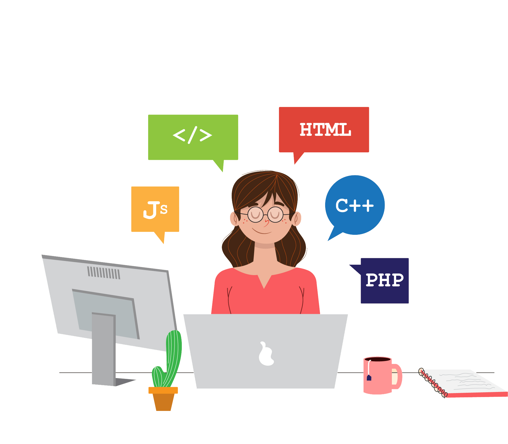

### Olá , Seja bem-vindo ao meu perfil!

---

### Sou 🙋‍♀️ Leticia Rosário

- Jr. Front-end Web developer, analista de sistema.

* Cabo-verdiana.
* 🎓Formada em Informática de Gestão.
* Meu primeiro contato com linguagem programação foi linguagem c, depois algoritmos e estruturas de dados, a seguir veio java e base de dados.
* 💜Tenho alguma experiencia com Scrum, metodo BDD(Desenvolvimento orientado por comportamento).

- Hobbies: 📚, 🎧, 💻.
- Interesse em: Tailwind, Sass, react, Sql.

* 🎯 Objetivos: tornar-me uma grande programadora em quem sabe mais a frente tornar-me um Full Stack Web developer anos a frente front-end e back-end vão acabar se juntando.

### Contato

<!---
leticiarosario/leticiarosario is a ✨ special ✨ repository because its `README.md` (this file) appears on your GitHub profile.
You can click the Preview link to take a look at your changes.
--->

---

#### 🧰 Skills and Tools

 

---

### 📈 My status

[hashnode]: https://hashnode.com/@leticiadev
