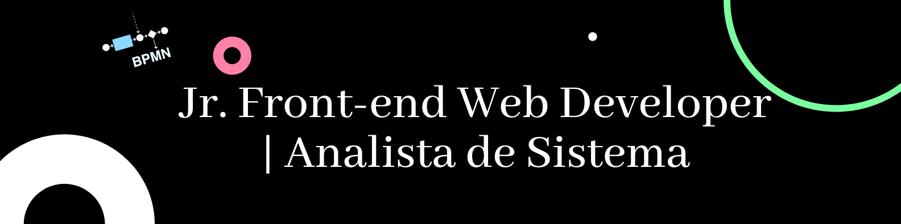

### Olá , Seja bem-vindo ao meu perfil!

### Sou 🙋‍♀️ Leticia Rosário

Sou cabo-verdiana,🎓Formada em Informática de Gestão.
Meu primeiro contato com linguagem programação foi linguagem c, depois algoritmos e estruturas de dados, a seguir veio java e base de dados.
💜Tenho alguma experiencia com Scrum, metodo BDD(Desenvolvimento orientado por comportamento), Msql, Postgresql.

### Hobbies

📚, 🎧, 💻.

🎯 Objetivos: tornar-me uma grande programadora em quem sabe mais a frente tornar-me um Full Stack Web developer anos a frente front-end e back-end vão acabar se juntando.

### Interesse em:

### Entre em contato

<!---
leticiarosario/leticiarosario is a ✨ special ✨ repository because its `README.md` (this file) appears on your GitHub profile.
You can click the Preview link to take a look at your changes.
--->

---

<h3 align="center">Github Profile Trophy </h3>

  

---

 
<h3 align="center">🧰 Skills and Tools</h3>

 
 

---

<h3 align="center"> 📈 My status</h3>

&nbsp;

