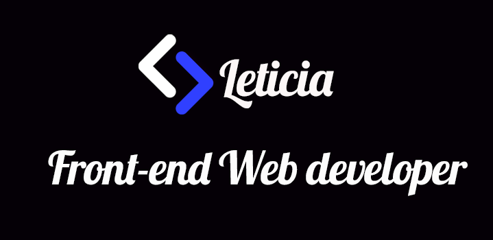

- 🌱 I’m currently learning javascript, css, html, sass, bootstrap

- 💞️ I’m looking to collaborate on as freelancer
- 📫 How to reach me   
[][facebook]
[][linkedin]
[][slack]

<!---
leticiarosario/leticiarosario is a ✨ special ✨ repository because its `README.md` (this file) appears on your GitHub profile.
You can click the Preview link to take a look at your changes.
--->
### My skills and Tools:

 
 

### My Blogs
[][hashnode]
[][medium]

 
 

### My status

[facebook]:https://www.facebook.com/Leticiadeveloper
[linkedin]:https://www.linkedin.com/in/leticiarosario26/
[slack]:https://app.slack.com/client/TDGEDER0X/CDF7Q174L/user_profile/U01QU3AHBRP
[hashnode]:https://hashnode.com/@leticiadev
[medium]:https://medium.com/@leticiarosario67
